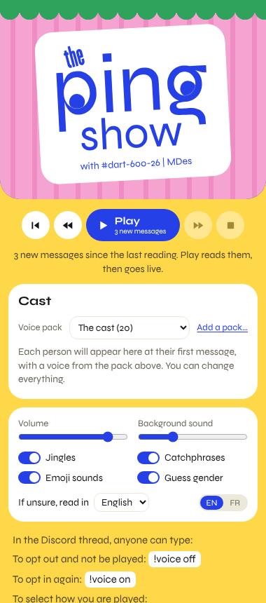
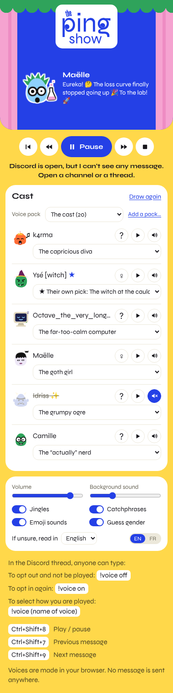
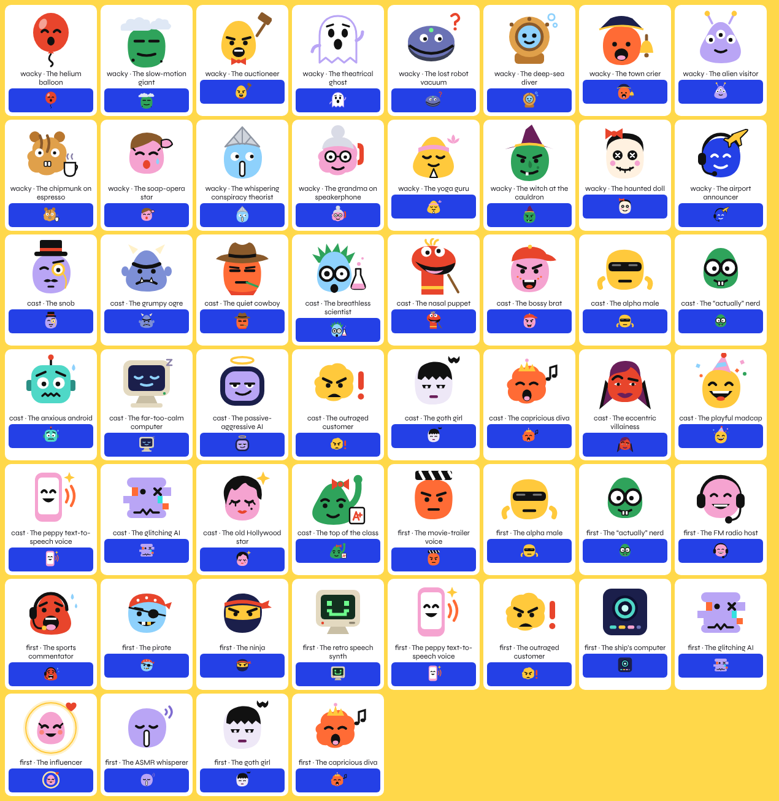

# The Ping Show

A Chrome extension that reads Discord out loud, live or as a replay, with a
funny character voice for each person in the thread.

Voices are computed **inside your browser**. The text of the messages is
never sent anywhere.

  
  

## What it does

- **Reads the thread you are looking at**, message by message, as it
  arrives. Play first catches up on the messages you have not heard yet
  (up to a day old); you can also go back one message at a time, or replay
  from the top.
- **Gives each person a character**: 52 of them in three voice packs
  (a helium balloon, a slow-motion giant, a grumpy ogre, an outraged
  customer, a pirate…), each with a one-second jingle, a few catchphrases
  and a face.
- **Lets people pick their own voice, or opt out**: one message is enough.
  Anyone types `!voice ogre` in the thread to choose a character, or
  `!voice off` to not be read at all.
- **Turns emojis into sound effects**: a child's laugh for 😂, applause for
  👏, a sad trombone for 😢, a fanfare for 🎉, snoring for 😴, a cow for 🐮…
  about eighty sounds, played where the emoji was written.
- **Skips what should not be spoken**: web addresses, e-mail addresses,
  file paths, code blocks, hidden text.
- **Needs no bot, no admin, no account.** Everyone who wants to listen
  installs it on their own computer.

## Install

Chrome 116 or newer, on a computer (Edge, Brave and Arc accept this kind of
extension too, but it has only been tried in Chromium).

1. Download `the-ping-show-v6.5.1.zip` from the
   [Releases](../../releases) page and unzip it.
2. In Chrome, open `chrome://extensions`.
3. Turn on **Developer mode** (top right).
4. Click **Load unpacked** and choose the `extension` folder.
5. Pin the eye icon (the puzzle piece, then the pin).

To update, replace the folder and click the reload arrow of the extension.

## Use

Open Discord in a Chrome tab (`discord.com/app`), show a channel or a
thread, and click the eye icon: the panel opens on the side. Press **Play**.

The first time, the voices are downloaded (about 80 MB before reading can
start, another 80 MB in the background) and then kept by the browser.

| | Windows, Linux | Mac |
| --- | --- | --- |
| Play / pause | Ctrl+Shift+8 | ⌘⇧8 |
| Previous message | Ctrl+Shift+7 | ⌘⇧7 |
| Next message | Ctrl+Shift+9 | ⌘⇧9 |

These shortcuts work from any application while Chrome is running and the
panel is open. They can be changed at `chrome://extensions/shortcuts`.

More in the [user guide](docs/GUIDE.md).

## Voice packs

A voice pack is one JSON file: characters, their voice settings,
catchphrases, jingle, background sounds and face. Three packs come with the
extension; **Add a pack…** in the panel loads your own. See
[Writing a voice pack](docs/VOICE-PACKS.md).

The characters are archetypes. The speech engine cannot imitate a specific
person or an existing character, and the project does not try to.

## Privacy

Everything happens in the browser: the extension reads the messages already
shown on the Discord page, like a screen reader, and turns them into sound
locally. Its only network access is the one-time download of the voice
files. Details in [PRIVACY.md](PRIVACY.md).

## Status and limits

- This is a young project, made in a day. It has been checked with
  automated tests against a mock Discord page and used by its author; it
  has not been through wide real-world use.
- It works on the web version of Discord in a desktop browser, not in the
  Discord desktop or phone apps.
- It finds the messages from the structure of the Discord page. If Discord
  changes that structure, `extension/contenu.js` will need an update.
- The Ping Show is not affiliated with, endorsed by, or supported by
  Discord.

## Disclaimer

The Ping Show is a hobby project, provided **as is, with no warranty of any
kind** (see sections 15 and 16 of the [licence](LICENSE)). To the extent
the law allows, its author is not responsible for any damage, loss or
consequence that comes from installing or using it.

You are responsible for how you use it. In particular:

- **Discord's rules.** Discord's terms restrict automating user accounts
  and modifying its apps. The Ping Show does not post or act on your
  account and only reads the page shown in your own browser, but whether a
  given use is acceptable is for Discord to decide, and its rules and its
  site can change at any time. Read Discord's Terms of Service and the
  rules of the servers you are in. You use the extension at your own risk,
  including for your Discord account.
- **Other people's messages.** The extension reads aloud what other people
  wrote. Make sure the people in the thread are fine with it, and with who
  can hear it: do not play, record or broadcast their messages (speakers in
  a shared room, a call, a stream) without their agreement. Anyone can opt
  out by typing `!voice off`; respect it.
- **The law where you are.** Privacy, data-protection and recording laws
  differ from place to place; complying with them is up to you.
- **Voice packs.** A pack added from a file is the responsibility of
  whoever made it and whoever loads it. The built-in characters are
  archetypes; any resemblance to a real person is unintended.

This is a plain-language notice, not legal advice.

## How it is built

- Speech: [Piper](https://github.com/rhasspy/piper) voices, run in the
  browser with [ONNX Runtime Web](https://github.com/microsoft/onnxruntime)
  and the piper-phonemize WebAssembly build.
- Character effects, jingles and background sounds are computed by the
  extension's own code.
- Emoji sound effects are public-domain recordings, instrument samples and
  computed sounds; each one is credited in
  [extension/effets/SOURCES.md](extension/effets/SOURCES.md).
- The source code is commented in French. A map of the files is in
  [docs/FILES.md](docs/FILES.md).

## Licence and credits

The Ping Show is free software under the
[GNU General Public License, version 3 or later](LICENSE).
Third-party components and voice datasets are listed in
[NOTICE.md](NOTICE.md).

The “the ping show” logo and the eye icon are not covered by the GPL; all
rights reserved.

Made by François-Akio Côté, with Claude (Anthropic) writing the code.
